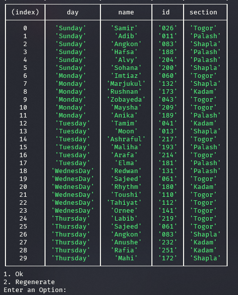
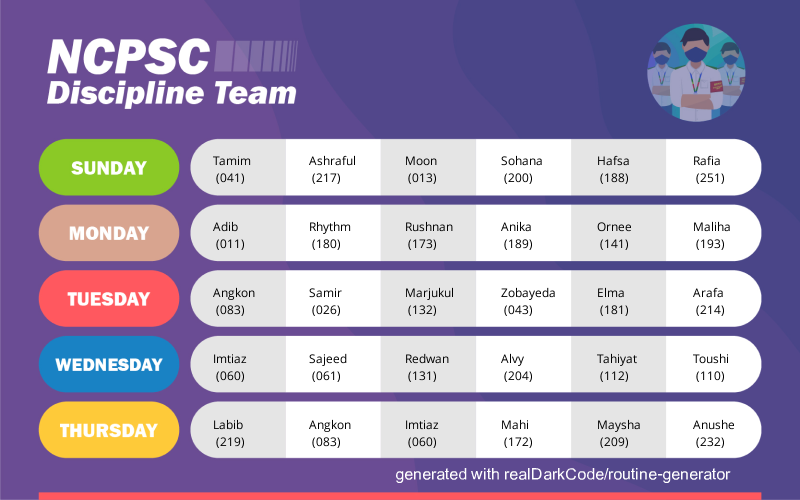
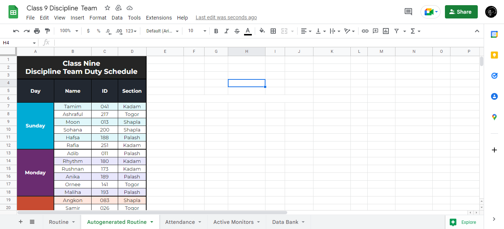

# routine-generator

- [routine-generator](#routine-generator)
  - [Overview](#overview)
  - [Prerequisites](#prerequisites)
  - [Installation](#installation)
  - [used packages](#used-packages)
  - [Screenshots](#screenshots)

## Overview

A simple routine generator for **NCPSC Discipline Team**.

As a member of the discipline team monitor, we have to **generate our duty schedule each week**. Hence I created this script to automate this process. We have a spreadsheet containing all the members' data.

At first, It fetches the Members list from the google sheet and saves that locally. then generate 5 day (6 members each day) routine and update that routine into the google sheet. then I just made some slight changes if I had to. lastly It fetches the updated routine and places this name into a template routine image

## Prerequisites

- [nodejs](https://nodejs.org/en/) >= `16.15.1`

## Installation

1. clone this repository or simply [download](https://github.com/realDarkCode/routine-generator/archive/refs/heads/main.zip)

   ```bash
   git clone git@github.com:realDarkCode/routine-generator.git
   ```

1. navigate to project folder
   ```bash
   cd routine-generator
   ```
1. Install dependencies
   ```bash
   npm i
   ```
1. Setup authentication
   1. Create a A [Google Cloud Platform project](https://developers.google.com/workspace/guides/create-project) with the API enabled.
   1. Setup Authentication with [OAuth 2](https://developers.google.com/workspace/guides/create-credentials#oauth-client-id)
   1. Download OAuth 2.0 Client IDs as JSON
   1. Move that file into project root and rename as `credentials.json`
1. Run script
   ```bash
   npm start
   ```

## used packages

- [googleapis](https://www.npmjs.com/package/googleapis) - for reading and updating data into google sheets.
- [@google-cloud/local-auth](https://www.npmjs.com/package/@google-cloud/local-auth) - for authenticating with google.
- [jimp](https://www.npmjs.com/package/jimp) - for writing text into image
- [prompt-sync](https://www.npmjs.com/package/prompt-sync) - taking input from console

## Screenshots




